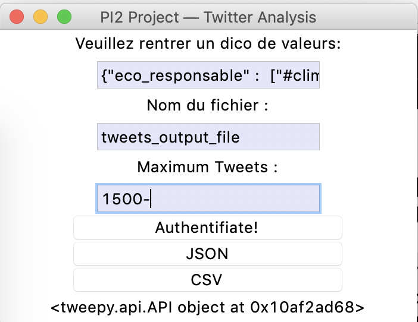

# Pi2_A5 - Project

## Introduction

This project is a final year project meant to be elaborated in parternship with a company, here a startup named Globedreamers.

Globedreamers is a platform for the promotion of humanistic travel and connects project leaders (individuals, associations, companies) to finances (crowdfunding or sponsoring) which in latter case enables companies to humanise their brand and to engage their communities through their own values.

## Objectives

This startup was interested in having a turnkley solution that would automatically :
* find one company's values and involvements matching different themes (social, environmental, etc...)
* or the other way around : for a theme (environmental, social,...), finds companies deeply engaged and then most likely to be interested to sponsor travel or suggested projects.

## Methods

To  fulfill those requirements, it has been decided to 
* Use **Twitter API**( **Tweepy module** for API access — **Python**) and retrieve informations from recent tweets related to those thematics.
* A **sentimental analysis** might be use on tweets text to look at how people sees some companies'involvment.
* We might add **LinkedIn API** support in order to find from which company those who posts original contents belong to, based on the clearly reasonnable assumption that LinkedIn users often fill and update information criteria on job position and company they are working in.

## Simple graphical interface example

This is how the interface should look like :

# pi2_A5
